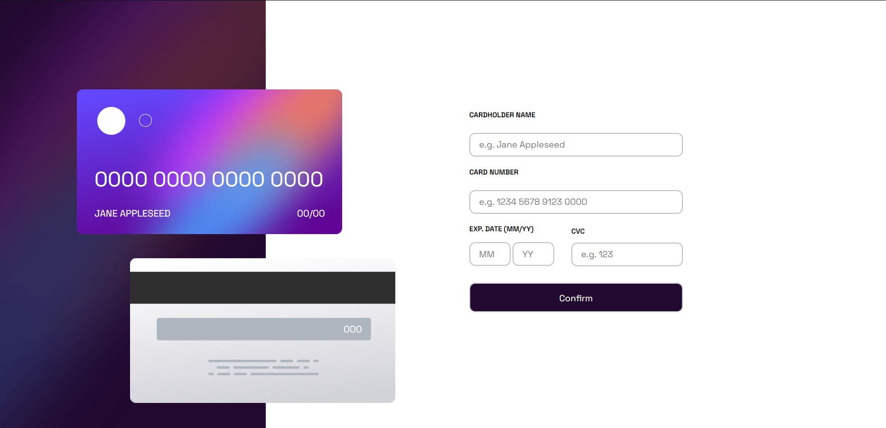

# Frontend Mentor - Interactive card details form solution

This is a solution to the [Interactive card details form challenge on Frontend Mentor](https://www.frontendmentor.io/challenges/interactive-card-details-form-XpS8cKZDWw). Frontend Mentor challenges help you improve your coding skills by building realistic projects. 

## Table of contents

- [Overview](#overview)
  - [The challenge](#the-challenge)
  - [Screenshot](#screenshot)
  - [Links](#links)
- [My process](#my-process)
  - [Built with](#built-with)
  - [What I learned](#what-i-learned)
  - [Useful resources](#useful-resources)


## Overview

### The challenge

Users should be able to:

- Fill in the form and see the card details update in real-time
- Receive error messages when the form is submitted if:
  - Any input field is empty
  - The card number, expiry date, or CVC fields are in the wrong format
- View the optimal layout depending on their device's screen size
- See hover, active, and focus states for interactive elements on the page

### Screenshot



### Links

- Solution URL: [https://github.com/Arekshiss/interactive_card]
- Live Site URL: [https://zippy-raindrop-e868b6.netlify.app]

## My process

### Built with

- Semantic HTML5 markup
- CSS custom properties
- Flexbox
- CSS Grid
- Jquery Validator


### What I learned

I have a better understanding about css and how to position elements in the view. Furthermore, how to change the size of the elements when the size of the view changes.


```css
@media (max-width:500px) {
  .container-card {
        display: flex;
        flex-direction: column;
        width: 525px;
        height: 890px;
    }
}
```

Besides, I learned to use jquery validator to control what users enter, through a regular expression to try to match in the input text.

```js
  $.validator.addMethod("justLetters", function (value, element) {
      return this.optional(element) || /^[a-z\s.A-Z]+$/i.test(value);
  }, "Wrong format, letters only");
```

### Useful resources

- [https://developer.mozilla.org/en-US/docs/Web/JavaScript/Guide/Regular_expressions] - This helped me understand how regular expressions are structured and how to condition strings.
- [https://www.regextester.com] - This website helped me practice the conditions for creating regular expressions.
